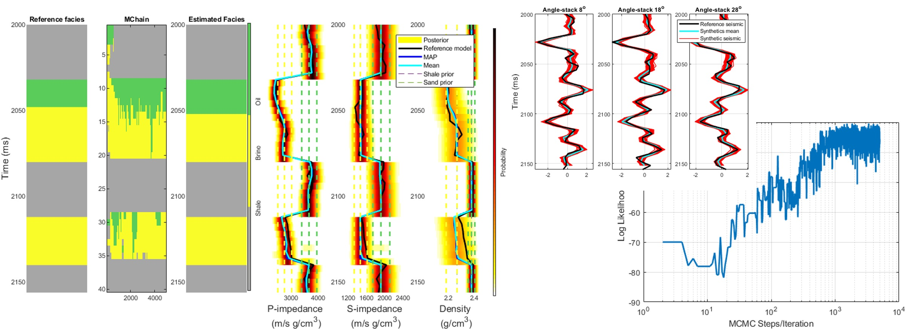
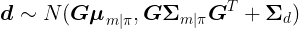

# Gaussian Mixture MCMC - Metropolis

### Gaussian mixture Markov chain Monte Carlo method for linear seismic inversion ###

This algorithm is related to the following publication about joint facies seismic inversion: 

Leandro Passos de Figueiredo, Dario Grana, Mauro Roisenberg, and Bruno B. Rodrigues, (2019), "Gaussian mixture Markov chain Monte Carlo method for linear seismic inversion," GEOPHYSICS 84: R463-R476.
https://doi.org/10.1190/geo2018-0529.1

# Erratum on the article

After a few months of publication we realized that p(d|π) is much simpler than what we have presented in the article. In the code of this repository, one can see how we actually p(d|π) use it in the algorithm.

Because both distributions p(d|m) and p(m|π) are assumed to be Gaussians, p(d|π) is also a Gaussian distribution

### Abstract ###

We have developed a Markov chain Monte Carlo (MCMC) method for joint inversion of seismic data for the prediction of facies and elastic properties. The solution of the inverse problem is defined by the Bayesian posterior distribution of the properties of interest. The prior distribution is a Gaussian mixture model, and each component is associated to a potential configuration of the facies sequence along the seismic trace. The low frequency is incorporated by using facies-dependent depositional trend models for the prior means of the elastic properties in each facies. The posterior distribution is also a Gaussian mixture, for which the Gaussian component can be analytically computed. However, due to the high number of components of the mixture, i.e., the large number of facies configurations, the computation of the full posterior distribution is impractical. Our Gaussian mixture MCMC method allows for the calculation of the full posterior distribution by sampling the facies configurations according to the acceptance/rejection probability. The novelty of the method is the use of an MCMC framework with multimodal distributions for the description of the model properties and the facies along the entire seismic trace. Our method is tested on synthetic seismic data, applied to real seismic data, and validated using a well test.

### Guide ###

Run the file main_synthetic_test.m and see it running with a synthetic dataset.

The repository is organized as follow:

- *GaussianMixMCMC_metropolis.m:* Main function about the methodology 
- *data:* this folder contains a synthetic dataset used as an example
- *functions:* this folder contains functions with by the method;

